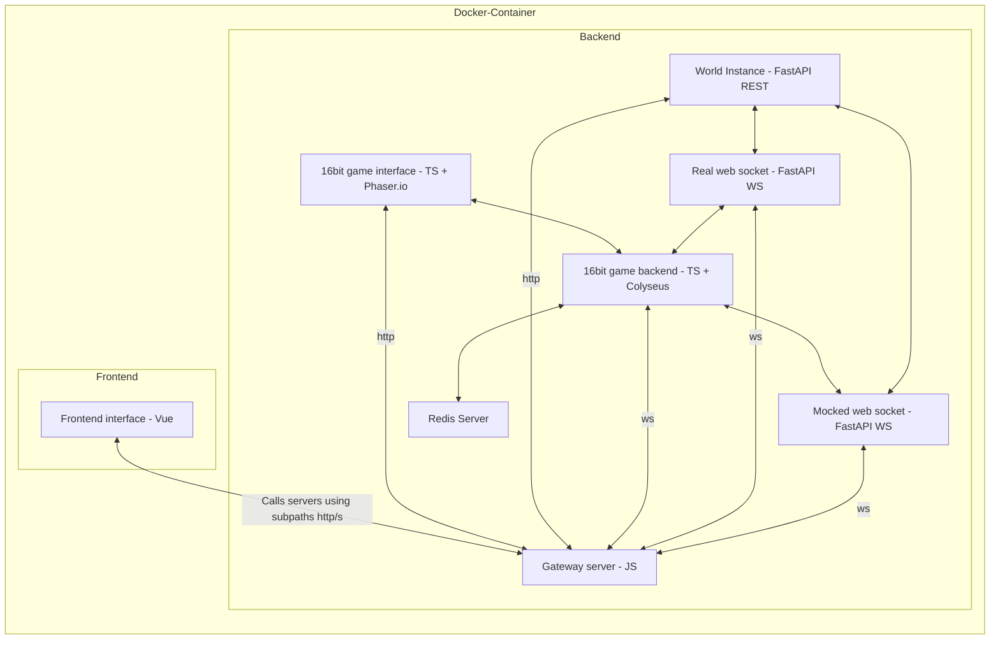

# How to build and run the image

```sh
docker build -t genworlds-world-app -f ./deployments/single-container/Dockerfile .
docker run -p 80:80 -p 9000:9000 -d genworlds-world-app
```

Then open the browser and go to `http://localhost/`

## Architecture



### Services

#### Frontend

* Frontend interface - Vue: `http://localhost/` port `80` (exposed to the host)
* 16bit game interface - TS + Phaser.io: `http://localhost:8081/` port `8081`

#### Backend

* Gateway server - JS: `http://localhost:9000/` port `9000` (exposed to the host)
* World Instance - FastAPI REST: `http://localhost:7457/` port `7457`
* Real web socket - FastAPI WS: `http://localhost:7456/` port `7456`
* Mocked web socket - FastAPI WS: `http://localhost:7455/` port `7455`
* 16bit game backend - TS + Colyseus: `http://localhost:5000/` port `5000`
* Redis Server: `http://localhost:6379/` port `6379`
