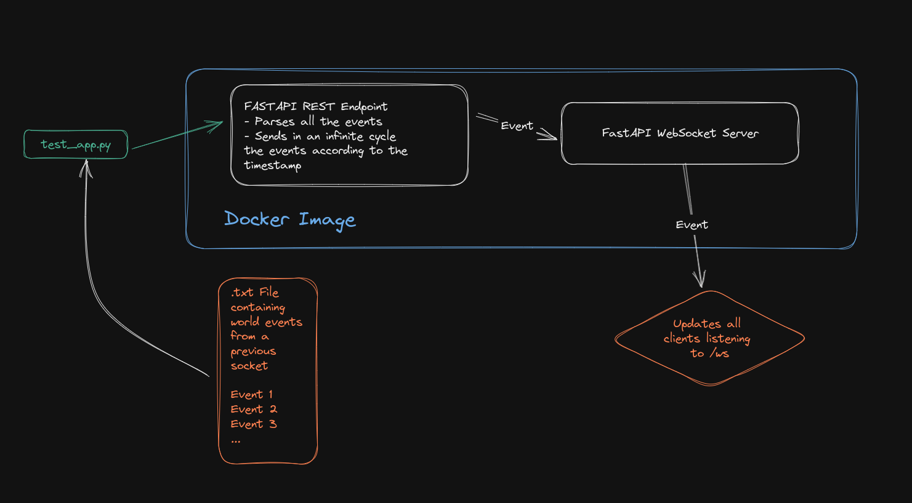

# Mocked World Socket
## Graphical description

## Usage Instructions
To build the docker image, firs we need to:
```bash
docker build -t mocked-world-event-stream .
```

Then to run it:
```bash
docker run -p 7456:7456 mocked-world-event-stream
```

After that we can run:
```bash
python test/test_app.py
```
To send the `10min_events.txt` mocked data to the endpoint and the socket will start looping through all the events contained in the file.